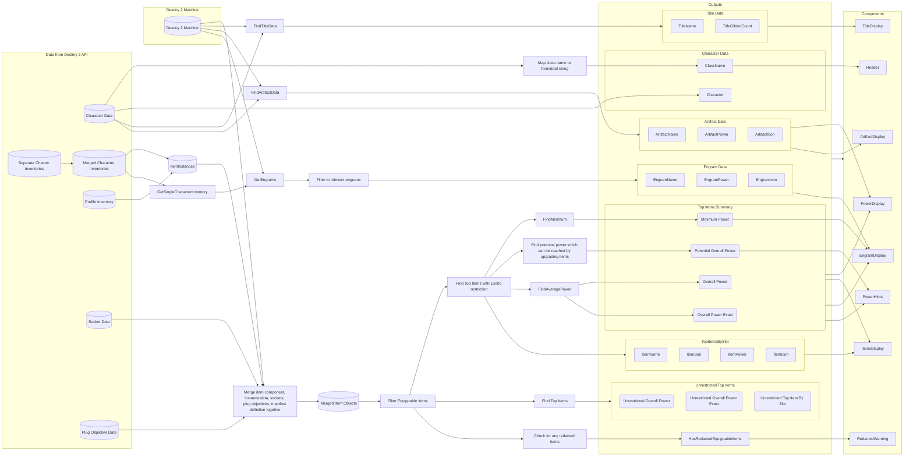

```mermaid
graph LR
  subgraph Data from Destiny 2 API
    CharacterData
    SeparateCharacterInventories[(Separate Chacter Inventories)]
    CharacterInventories
    ProfileInventory
    Sockets
    PlugObjectives
  end

  subgraph Destiny 2 Manifest
    Manifest
  end

  SeparateCharacterInventories --> CharacterInventories

  CharacterInventories[(Merged Character Inventories)] --> Items
  ProfileInventory[(Profile Inventory)] --> Items

  Items[(ItemInstances)] --> MergeItems
  Sockets[(Socket Data)] --> MergeItems
  PlugObjectives[(Plug Objective Data)] --> MergeItems
  Manifest[(Destiny 2 Manifest)] --> MergeItems

  MergeItems[Merge item component, instance data, sockets, plug objectives, manifest definition together] --> MergedItems[(Merged Item Objects)]

  CharacterData[(Character Data)]

  MergedItems --> FilterEquippable[Filter Equippable Items]

  FilterEquippable --> FindTop[Find Top Items with Exotic restriction]
  FilterEquippable --> FindTopUnrestricted[Find Top Items]

  FindTop --> FindMinimum
  FindTop --> FindPotential[Find potential power which can be reached by upgrading items]
  FindTop --> TopItemsBySlot
  FindTop --> FindAveragePower
  FindAveragePower --> OverallPower
  FindAveragePower --> OverallPowerExact

  CharacterData --> MapClassName[Map class name to formatted string]

  CharacterData --> Character
  MapClassName --> ClassName
  FindTopUnrestricted --> UnrestrictedTopItems
  FindMinimum --> MinPower
  FindPotential --> PotentialOverallPower

  CharacterData --> FindTitleData
  Manifest --> FindTitleData
  FindTitleData --> TitleDataOutput

  CharacterData --> FindArtifactData
  Manifest --> FindArtifactData
  FindArtifactData --> ArtifactDataOutput

  CharacterInventories --> GetSingleCharacterInventory
  GetSingleCharacterInventory --> GetEngrams
  Manifest --> GetEngrams
  GetEngrams --> FilterEngrams[Filter to relevant engrams]

  FilterEquippable --> CheckForRedacted[Check for any redacted items]
  CheckForRedacted --> HasRedactedEquippableItems

  FilterEngrams --> EngramDataOutput


  subgraph Outputs

    subgraph CharacterDataOutput [Character Data]
      Character
      ClassName
    end

    subgraph TopItemsBySlot
      ItemName
      ItemSlot
      ItemPower
      ItemIcon
    end

    subgraph TopItemsSummary [Top Items Summary]
      OverallPower(Overall Power)
      OverallPowerExact(Overall Power Exact)
      MinPower(Minimum Power)
      PotentialOverallPower(Potential Overall Power)
    end

    subgraph UnrestrictedTopItems [Unrestricted Top Items]
      UnrestrictedOverallPower(Unrestricted Overall Power)
      UnrestrictedOverallPowerExact(Unrestricted Overall Power Exact)
      TopUnrestrictedItemBySlot(Unrestricted Top Item By Slot)
    end

    HasRedactedEquippableItems

    subgraph ArtifactDataOutput [Artifact Data]
      ArtifactName
      ArtifactPower
      ArtifactIcon
    end

    subgraph TitleDataOutput [Title Data]
      TitleName
      TitleGildedCount
    end

    subgraph EngramDataOutput [Engram Data]
      EngramName
      EngramPower
      EngramIcon
    end

  end

  Outputs --> Components

  subgraph Components

    ClassName --> Header

    TopItemsSummary --> PowerDisplay
    ArtifactDataOutput --> PowerDisplay

    TitleDataOutput --> TitleDisplay

    ArtifactDataOutput --> ArtifactDisplay

    TopItemsBySlot --> ItemsDisplay
    TopItemsSummary --> ItemsDisplay

    EngramDataOutput --> EngramDisplay
    TopItemsSummary --> EngramDisplay
    MinPower --> EngramDisplay

    TopItemsSummary --> PowerHints
    PotentialOverallPower --> PowerHints

    HasRedactedEquippableItems --> RedactedWarning

  end
```
